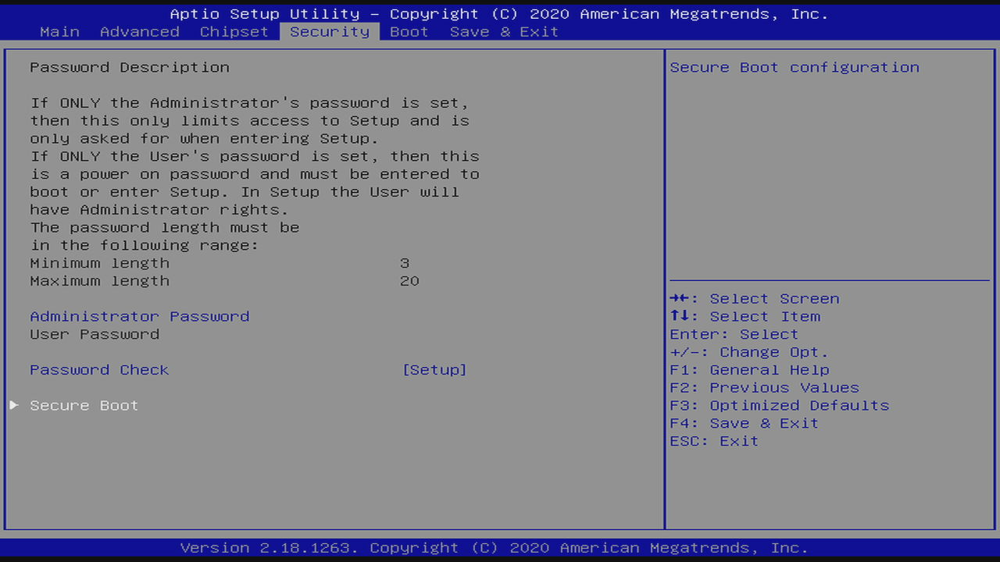
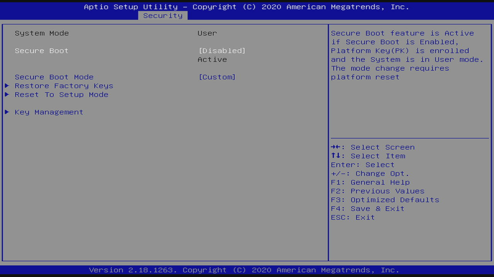
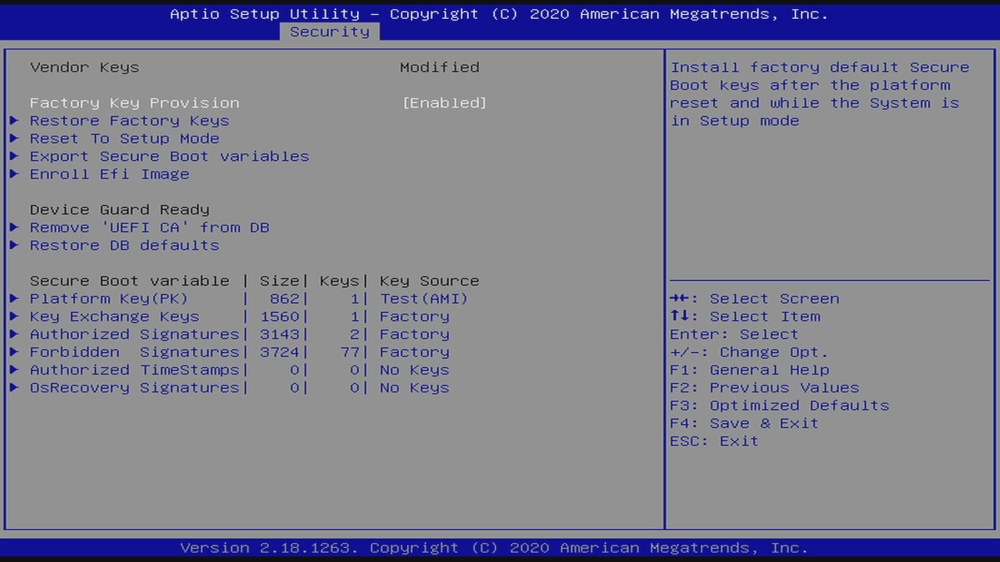
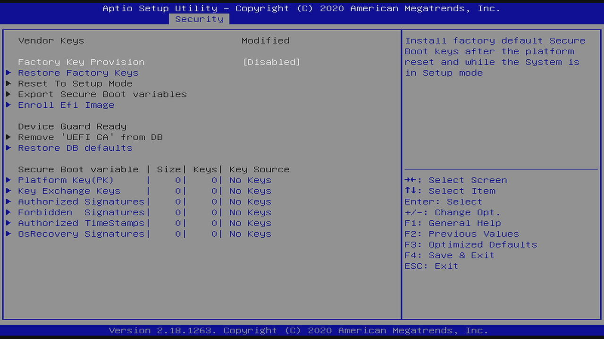

## Secure Boot (aka secureboot; aka SB)

Boot into the firmware by powering on the machine and then pressing DELETE.

On the firmware `Main` tab, navigate to the `Security` tab. You should see something alike:



Navigate to the `Secure Boot` menu entry and press ENTER.

You should see something alike:



Navigate to the `Secure Boot` menu entry and press ENTER. Choose `Enabled` and press ENTER.

Press `F4` to `Save & Exit`.

Then boot into Ubuntu.

**NB** While booting, if a "Secure Boot Violation; Invalid signature detected" message appears, you have to re-create the uefi boot loader entries as described in the `UEFI Boot Loader` section.

Confirm its executing in secure boot mode:

```bash
mokutil --sb-state
```

Should display:

```plain
SecureBoot enabled
```

List the secure boot trust stores:

```bash
apt-get install -y efitools
efi-readvar
```

```plain
Variable PK, length 862
PK: List 0, type X509
    Signature 0, size 834, owner 26dc4851-195f-4ae1-9a19-fbf883bbb35e
        Subject:
            CN=DO NOT TRUST - AMI Test PK
        Issuer:
            CN=DO NOT TRUST - AMI Test PK
Variable KEK, length 1560
KEK: List 0, type X509
    Signature 0, size 1532, owner 77fa9abd-0359-4d32-bd60-28f4e78f784b
        Subject:
            C=US, ST=Washington, L=Redmond, O=Microsoft Corporation, CN=Microsoft Corporation KEK CA 2011
        Issuer:
            C=US, ST=Washington, L=Redmond, O=Microsoft Corporation, CN=Microsoft Corporation Third Party Marketplace Root
Variable db, length 3143
db: List 0, type X509
    Signature 0, size 1572, owner 77fa9abd-0359-4d32-bd60-28f4e78f784b
        Subject:
            C=US, ST=Washington, L=Redmond, O=Microsoft Corporation, CN=Microsoft Corporation UEFI CA 2011
        Issuer:
            C=US, ST=Washington, L=Redmond, O=Microsoft Corporation, CN=Microsoft Corporation Third Party Marketplace Root
db: List 1, type X509
    Signature 0, size 1515, owner 77fa9abd-0359-4d32-bd60-28f4e78f784b
        Subject:
            C=US, ST=Washington, L=Redmond, O=Microsoft Corporation, CN=Microsoft Windows Production PCA 2011
        Issuer:
            C=US, ST=Washington, L=Redmond, O=Microsoft Corporation, CN=Microsoft Root Certificate Authority 2010
Variable dbx, length 3724
dbx: List 0, type SHA256
    Signature 0, size 48, owner 77fa9abd-0359-4d32-bd60-28f4e78f784b
        Hash:80b4d96931bf0d02fd91a61e19d14f1da452e66db2408ca8604d411f92659f0a
    ... OMITED FOR BREVITY ...
Variable MokList has no entries
```

Save them to files and show their content:

```bash
efi-readvar -v PK -o PK.esl   # Platform Key (PK).
efi-readvar -v KEK -o KEK.esl # Key Exchange Key (KEK).
efi-readvar -v db -o db.esl   # Signature Database (DB); aka Allow list database.
efi-readvar -v dbx -o dbx.esl # Forbidden Signature Database (DBX); ala Deny list database.

# convert them to an openssl compatible .der or .hash files.
sig-list-to-certs PK.esl PK
sig-list-to-certs KEK.esl KEK
sig-list-to-certs db.esl db
sig-list-to-certs dbx.esl dbx

# show them.
find . -type f -name '*.der' -print | sort | xargs -I% bash -c 'echo;set -x;openssl x509 -noout -text -inform der -in %'
find . -type f -name '*.hash' -print | sort | xargs -I% bash -c 'echo;set -x;xxd -c 72 -p %'
```

### Take Ownership of the machine

To have more control over the machine you should take ownership of the machine by managing the secure boot trust stores.

This will ensure that the firmware only executes the code that you trust.

Reboot the machine to the firmware:

```bash
systemctl reboot --firmware-setup
```

On the firmware `Main` tab, navigate to the `Security` tab. You should see something alike:


Navigate to the `Secure Boot` menu entry and press ENTER.

You should see something alike:


Navigate to the `Secure Boot` menu entry and press ENTER. Choose `Enabled` and press ENTER.

Navigate to the `Key Management` menu entry and press ENTER.

You should now see something alike:



Navigate to the `Factory Key Provision` menu entry and press ENTER. Then choose `Disabled` and press ENTER.

Select `Reset To Setup Mode` and press ENTER. Then choose `Yes` and press ENTER.

You should now see something alike:



Press `F4` to `Save & Exit`.

After boot, the firmware must have secure boot disable and be in Setup Mode:

```bash
mokutil --sb-state
```

```plain
SecureBoot disabled
Platform is in Setup Mode
```

And all the Secure Boot EFI variables should have no entries:

```bash
efi-readvar
```

```plain
Variable PK has no entries
Variable KEK has no entries
Variable db has no entries
Variable dbx has no entries
Variable MokList has no entries
```

Disable the loading of secureboot-db (this loads dbx):

```bash
# TODO should we remove/blacklist this package?
systemctl disable secureboot-db.service
```

We are now ready to take ownership of the system by following the next steps.

Install go as described at https://golang.org/doc/install.

Install [sbctl](https://github.com/Foxboron/sbctl) with:

```bash
go get github.com/Foxboron/sbctl/cmd/sbctl
```

See the current boot state:

```bash
sbctl status
```

It must show:

```plain
==> WARNING: Setup Mode: Enabled
==> WARNING: Secure Boot: Disabled
```

Create our own Platform Key (PK), Key Exchange Key (KEK), and Code Signing CAs:

```bash
# NB this internally uses sbvarsign and sbvarsign commands.
# see https://github.com/Foxboron/sbctl/blob/fda4f2c1efd801cd04fb52923afcdb34baa42369/keys.go#L92-L100
# see https://github.com/Foxboron/sbctl/blob/fda4f2c1efd801cd04fb52923afcdb34baa42369/keys.go#L102-L110
sbctl create-keys
```

It should something alike:

```bash
==> Creating secure boot keys...
  -> Created UUID 52364904-f16c-4e09-b9eb-57907da8302a...
==> Create EFI signature list /usr/share/secureboot/keys/PK/PK.der.esl...
==> Signing /usr/share/secureboot/keys/PK/PK.der.esl with /usr/share/secureboot/keys/PK/PK.key...
==> Create EFI signature list /usr/share/secureboot/keys/KEK/KEK.der.esl...
==> Signing /usr/share/secureboot/keys/KEK/KEK.der.esl with /usr/share/secureboot/keys/PK/PK.key...
==> Create EFI signature list /usr/share/secureboot/keys/db/db.der.esl...
==> Signing /usr/share/secureboot/keys/db/db.der.esl with /usr/share/secureboot/keys/KEK/KEK.key...
```

In more detail, this created all these files:

```bash
# find /usr/share/secureboot/keys -type f
/usr/share/secureboot/keys/PK/PK.pem
/usr/share/secureboot/keys/PK/PK.key
/usr/share/secureboot/keys/PK/PK.der
/usr/share/secureboot/keys/PK/PK.der.esl
/usr/share/secureboot/keys/PK/PK.auth
/usr/share/secureboot/keys/db/db.auth
/usr/share/secureboot/keys/db/db.pem
/usr/share/secureboot/keys/db/db.der
/usr/share/secureboot/keys/db/db.der.esl
/usr/share/secureboot/keys/db/db.key
/usr/share/secureboot/keys/KEK/KEK.key
/usr/share/secureboot/keys/KEK/KEK.auth
/usr/share/secureboot/keys/KEK/KEK.pem
/usr/share/secureboot/keys/KEK/KEK.der
/usr/share/secureboot/keys/KEK/KEK.der.esl
```

Remove EFI variable protection (this is not yet implemented by sbctl):

```bash
chattr -i /sys/firmware/efi/efivars/{KEK,db}-*
```

Enroll the keys with the firmware:

```bash
# NB internally this will write the EFI variables by calling:
#       sbkeysync --pk --verbose --keystore /usr/share/secureboot/keys
# see https://github.com/Foxboron/sbctl/blob/fda4f2c1efd801cd04fb52923afcdb34baa42369/keys.go#L114-L115
sbctl enroll-keys
```

XXX This fails with https://gist.github.com/rgl/b7413738b671b7107d64ac93fbe6b823:

    ==> Syncing /usr/share/secureboot/keys to EFI variables...
    ==> ERROR: Couldn't sync keys

Then trying with sbkeysync --pk --verbose shows a tiny bit more information:

    Inserting key update /usr/share/secureboot/keys/db/db.auth into db
    Error writing key update: Invalid argument
    Error syncing keystore file /usr/share/secureboot/keys/db/db.auth
    Inserting key update /usr/share/secureboot/keys/KEK/KEK.auth into KEK
    Error writing key update: Invalid argument
    Error syncing keystore file /usr/share/secureboot/keys/KEK/KEK.auth

I was able to work around this by manually enrolling the keys by rebooting
into the firmware, and then using the firmware UI itself. BUT I want to
automate this, so using a UI is a no go.


Sign the Ubuntu boot loader:

```bash
sbctl sign /boot/efi/EFI/ubuntu/shimx64.efi
sbctl sign /boot/efi/EFI/ubuntu/grubx64.efi
sbctl sign /boot/efi/EFI/ubuntu/mmx64.efi
sbctl verify
```

Reboot:

```bash
reboot
```
